# [从红黑树的本质出发，彻底理解红黑树！](https://my.oschina.net/u/4108008/blog/4668932)

# 前言

早上好，我是彤哥。

上一节，我们一起从二叉树、二叉查找树、平衡树、AVL树、2-3树、2-3-4树、B树，一路讲到红黑树，最后得出红黑树的本质：红黑树就是2-3-4树，请看下图：

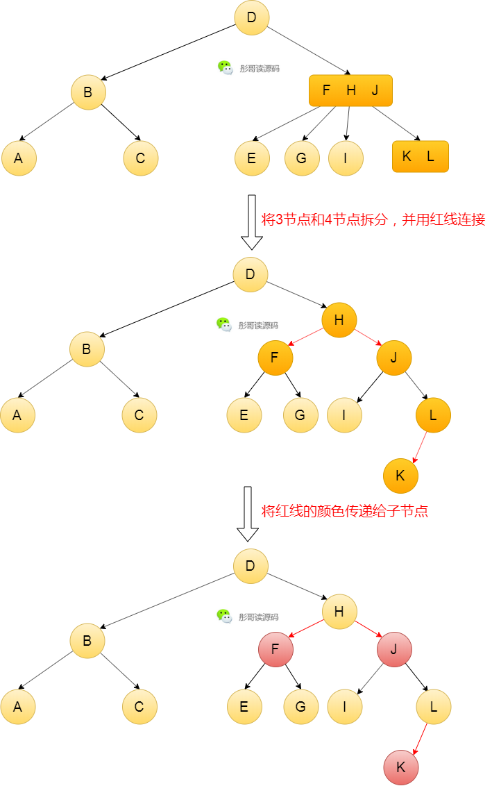

我们知道2-3-4的插入、删除、查找元素的原理是相当简单的，那么，我们是不是可以利用2-3-4树来记忆红黑树呢？

答案是肯定的，本节，我们就来看看如何利用2-3-4树来快速掌握红黑树，再也不用死记硬背了~~

好了，让我们进入今天的学习吧。

# 再忆2-3-4树

我们给出一张图简单地回顾一下上一节关于2-3-4树插入元素N的过程：

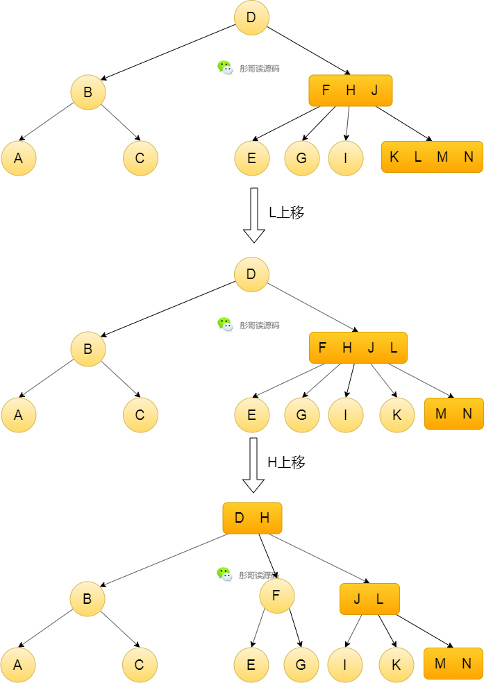

# 左倾红黑树、右倾红黑树、AA树

在正式讲解红黑树之前呢，彤哥先来给大家普及几个有意思的概念，分别是左倾红黑树、右倾红黑树、AA树。

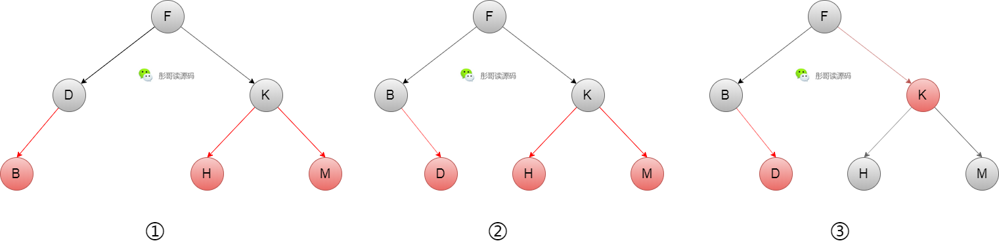

请看上图，其实按照红黑树的概念，上面3颗树都是红黑树，而且元素也是一模一样，可以说是同一颗红黑树的不同变种。

\> 细心的同学会发现①和②是同一颗2-3-4树演化而来，③是这颗2-3-4树缩小成2-3树的样子。

那么，到底什么是红黑树呢？

红黑树是每个节点都带有颜色属性的二叉查找树，颜色或红色或黑色。

首先，红黑树是一颗二叉查找树，另外，它还必须满足以下五点要求：

1. 节点是红色或黑色；
2. 根节点是黑色；
3. 所有叶子节点是黑色；（叶子节点是NULL节点）
4. 每个红色节点的两个子节点都是黑色；（从根节点到每个叶子节点的路径上不能有两个连续的红节点）
5. 从任何一个节点到每个叶子节点的所有路径都包含相同数目的黑色节点；

大家不用记这个概念哈，因为确实很难记得住哈，下面彤哥会教大家更简单的方法。

所以，你看上面三个图是不是都是红黑树呢？

并不是啊，因为叶子节点有的是红色的呀。

其实，它们都是红黑树，让我把叶子节点补齐：

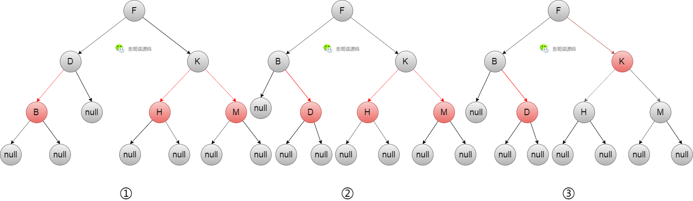

你再仔细看看，是不是满足上面五条规则了？！

所以，你看，随便画一颗树，它都可能满足红黑树的定义，因此，为了方便记忆，我们将红黑树分成这么几种类型：左倾红黑树、右倾红黑树、AA树。

**左倾红黑树（LLRB，Left-Learning Red-Black Tree）**，一个节点如果有红色子节点，那么，它的红色子节点是向左倾斜的。

怎么理解呢？

我们还是把上面的null节点干掉哈，叶子节点都是null节点，那是经典红黑树的讲法，到彤哥这里，完全不存在这种要求。

我们来看，一个节点要么有一个子节点，要么有两个子节点，对吧。

如果这个节点有红色的子节点呢，也是一个或者两个，如果只有一个红色子节点的话，那么，这个子节点只能在左边，如果是有两个红色子节点，那就不用管。

所以，整颗红黑树中，如果存在红色节点，那么只能是下面这两种形态：

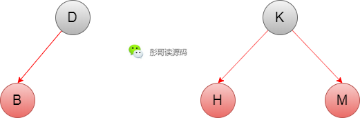

同理，**右倾红黑树（RLRB，Right-Learning Red-Black Tree）**，也是一样的道理，即红色子节点向右倾斜，它的红色子节点只能是下面这两种形态：

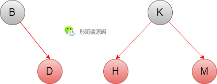

好了，左倾和右倾红黑树都还算比较正常的形态，还有一种变态的红黑树，叫作**AA树（AA Tree）**。

当然，这里的AA不是吃饭的时候大家各付各的哈，这里的AA是其作者的名字的缩写：**A**rne **A**ndersson。

**AA树**，是指红黑树中所有的红色子节点必须只能是右节点，左子节点一律不允许是红色子节点，所以，在AA树中，红色子节点只能是下面这一种形态：

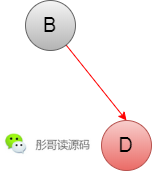

也可以理解为严重右倾主义（我这么说会不会被约去喝茶^^）。

\> 其实AA树可以看作2-3树的右倾演化而来，而不是2-3-4树，你可以画个图体验一下。

好了，上面就是左倾红黑树、右倾红黑树、AA树的概念，当然，也有可能存在一种红黑树，比如红色子节点只能是左子节点，是不是叫BB树，咱也不知道，还有一种可能是像下面这种红黑树：

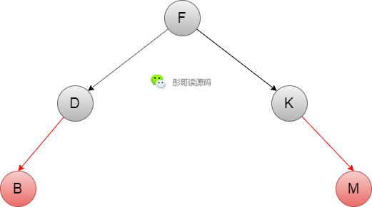

上面这颗树，它既有左边的红色子节点，也有右边的红色子节点，其实它也满足红黑树的定义，这种就只是普通（经典）的红黑树了。

既然红黑树有这么多完全不同的形态，我们要如何快速的记住它们呢？

很难，真的很难，所以，我们只需要记住一种形态就可以了，比如左倾红黑树，其它的形态都是一样的道理，完全不用强形记忆。

因此，下面的内容，我将全部以**左倾红黑树**来讲解，跟经典的红黑树讲法会有点出入，且跟你以前看到的所有文章都不一样，请不要纠结。

# 有趣的插入元素

首先，让我们约定一件事：**插入的节点必须为红色，但如果是根节点，就把它涂成黑色。**

有了这个约定之后，我们使用一步一图的方式来慢慢拆解红黑树（左倾，下同）插入元素的过程。

1. 插入第一个元素F

   第一个元素肯定是根节点，直接涂成黑色：

   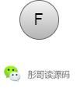

2. 插入第二个元素

这里分两种情况：比F小，比F大。

（1）假设插入的元素为D，那么，它比F小，所以会成为F的左子节点：

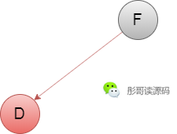

此时，D为红色左子节点，所以，不需要再平衡。

（2）假设插入的元素为K，那么，它比F大，所以会成为F的右子节点：

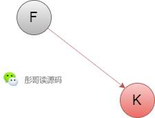

此时，K为红色右子节点，不符合左倾红黑树的规则，所以，需要再平衡，那么，要如何再平衡呢？

让我们回归红黑树的本质——2-3-4树，上面包含F和K两个元素的红黑树换成2-3-4树就变成了：

再把这个2-3-4树转换成左倾红黑树就变成了：

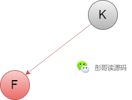

让我们画一张对比图来看看：

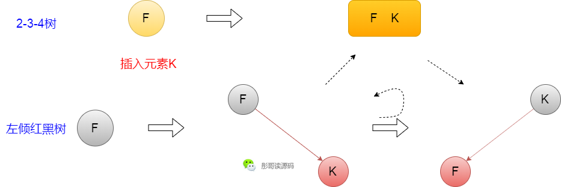

所以，你看，结合2-3-4树来理解红黑树是不是就特别简单了，对于2-3-4树就是一个普通的3节点，而对于红黑树相当于插入一个右子节点，再做一次左旋变色即可。

3. 插入第三个元素

我们以上述的`F K`两个元素的红黑树为例，在这个基础上再增加一个元素，这里可能有三种情况，我们一一来分析：

（1）假设插入的元素为D，它比F小，所以会成为F的左子节点：

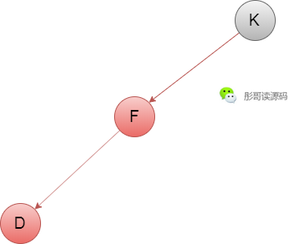

此时，显然不符合红黑树的定义了，所以，需要再平衡，那么如何平衡呢？来，上图：

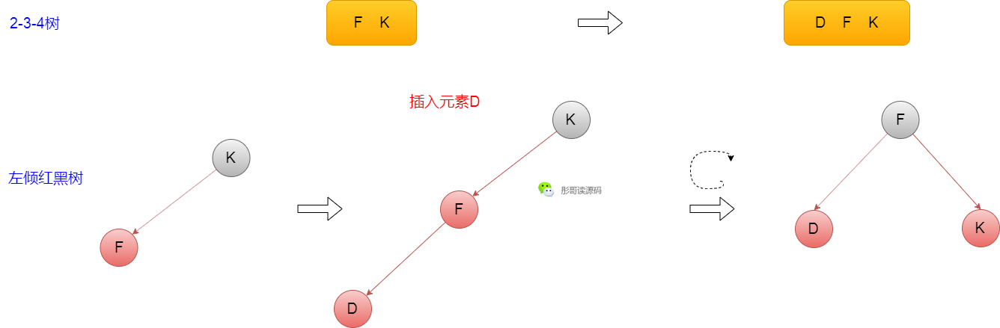

插入元素D，对于2-3-4树就是形成一个4节点，而对于红黑树树需要经过右旋再变色的过程。

（2）假设插入的元素为G，它比F大，比K小，所以会成为F的右子节点：

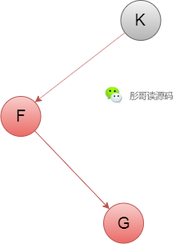

显然，它也不符合红黑树的定义，所以，也需要再平衡：

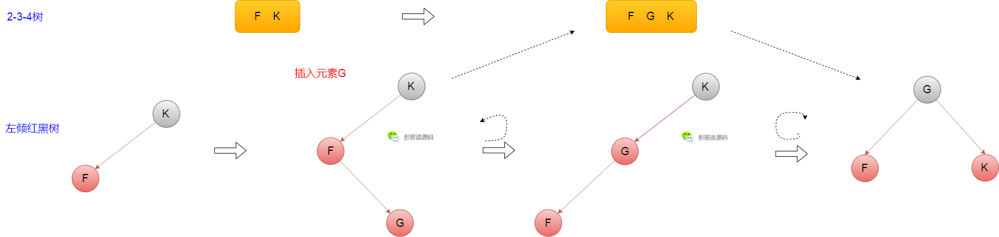

插入元素G，对于2-3-4树，只是形成一个普通的4节点，而对于红黑树，需要先以F左旋，变成与情况（1）相同的状态，再以G右旋，然后变色，最终再平衡成红黑树。

（3）假设插入的元素为N，它比K大，所以会成为K的右子节点：

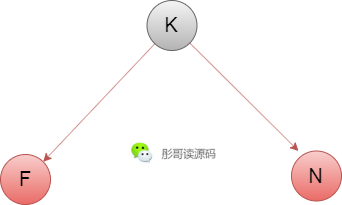

此时，正好符合红黑树的定义，不需要再平衡了，但是，我们同样画一张图对比看下：

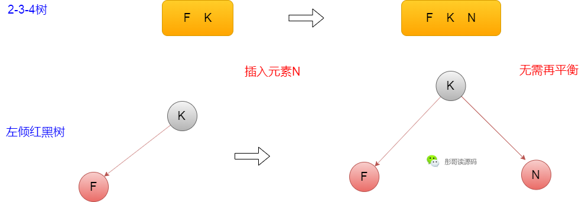

好了，通过上面的分析，连续插入三个元素，可以看到，对于2-3-4，都是形成一个4节点，而对于红黑树，最终都变成了下面这个样子：

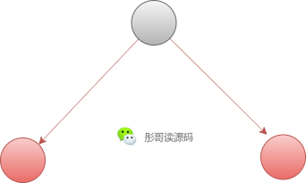

所以，我们再插入第四个元素看看。

4. 插入第四个元素

我们以`F K N`这颗红黑树为例，插入第四个元素，可能会出现四种情况，也就是分别可能会成为F和N的四个子节点的其中之一，简单点，我们直接上图：

（1）假设为D，其为F的左子节点

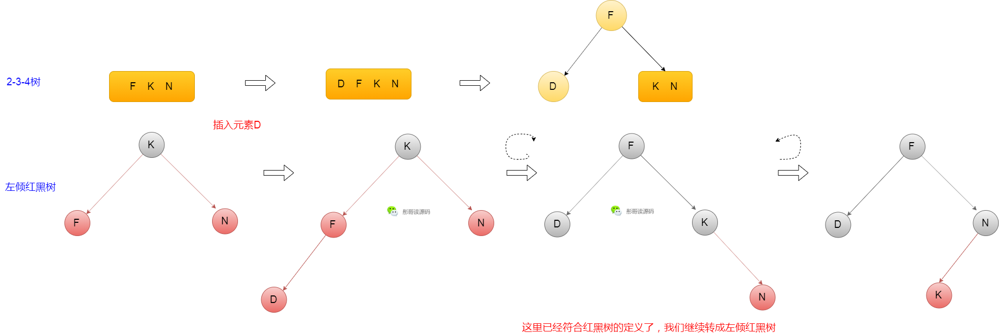

（2）假设为G，其为F的右子节点

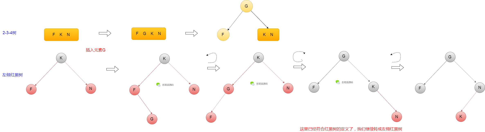

（3）假设为M，其为N的左子节点

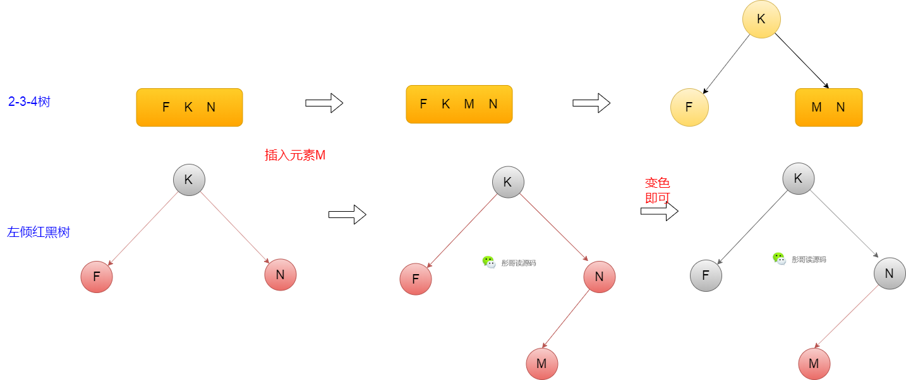

好了，插入四个元素的各种情况到此结束，可以看到，插入第四个元素时，对于2-3-4树，会形成一个5节点，然后再分裂，而对于红黑树，要经过一系列的左旋、右旋、变色，最终转变成跟2-3-4树对应的形态，是不是很好玩儿^^

5. 插入第五个元素

画图太累，交给你了~~

# 删除元素

不管是2-3-4树还是左倾红黑树删除元素的过程都要比插入元素复杂得多，我们先来看2-3-4树删除元素的过程。

## 2-3-4树删除元素

为了方便讲解，我构造了一颗下图所示的2-3-4树：

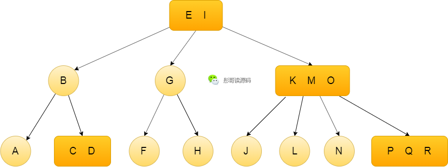

对于2-3-4树，删除3节点或4节点的叶子节点是最简单的，比如`C D`和`P Q R`这两个叶子节点，删除这两个节点中的任意一个元素直接删除即可，4节点删除一个元素后变成3节点，3节点删除一个元素之后变成2节点，并不影响原来树的平衡性，比如，删除C之后的结果如下：

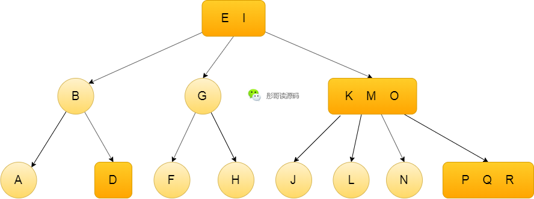

但是，删除2节点就不一样了，比如，上图删除`A`、`B`、`F`、`G`、`H`、`J`、`L`、`N`这几个节点，直接删除之后树就不平衡了，所以，需要想一些办法来保证删除L之后树依然是平衡的，怎么办呢？

答案是——偷！

没错，就是偷，从别的地方偷元素过来，把这个空缺补上，就像我们上班划水一样，总要找一些东西把工时补上对不对。

那么，怎么个偷法呢？

总体来说，分成两大类，子节点从父节点偷，父节点从子节点偷，偷着偷着可能还要合并或者迁移元素。

我们来分别看一下删除`A`、`B`、`F`、`G`、`H`、`J`、`L`、`N`这几个节点的过程是如何偷的，以下多图，请慎重！

（1）删除A

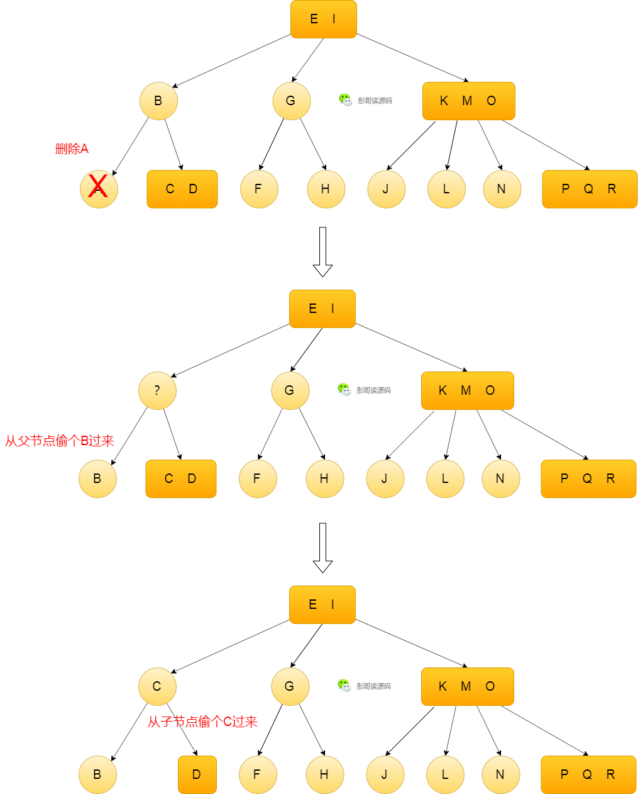

删除A元素时，先从父节点偷个B过来，此时，B位置空缺了，原来B的位置再从其右子节点偷个C过来，搞定。

（2）删除B

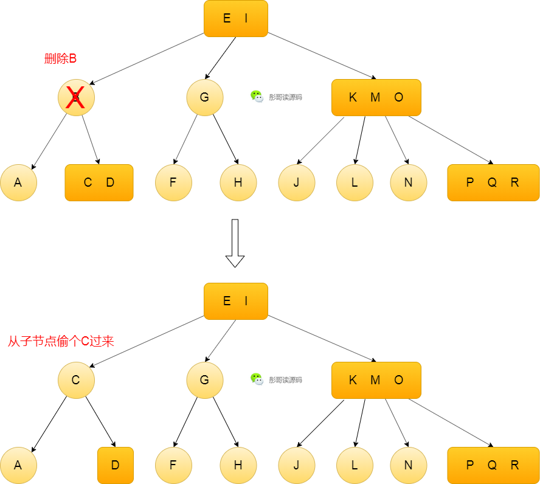

删除B就很简单了，直接从右子节点偷个C过来就搞定了。

（3）删除F

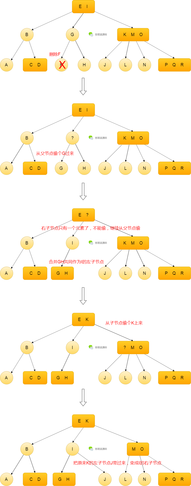

删除F的过程就比较复杂了，总之，始终围绕着一个原则：子节点偷不到就偷父节点的，偷过来的元素之后记得可能会合并或者迁移元素。

合并的规则是要始终保证整颗树的有序性，比如，上面从父节点偷了个I过来，它本身就比H大，所以，H必须放在I的左子节点，而左子节点原来已经有G了，所以，只能把它们俩合并了。

同理，迁移J元素的过程也是一样的，J肯定是要放在K的左边，迁移到I的右子节点正好。

（4）删除G

其实跟删除F时从偷I开始是一样的，就不赘述了。

（5）删除H

与删除F的过程一模一样，不再赘述。

（6）删除J

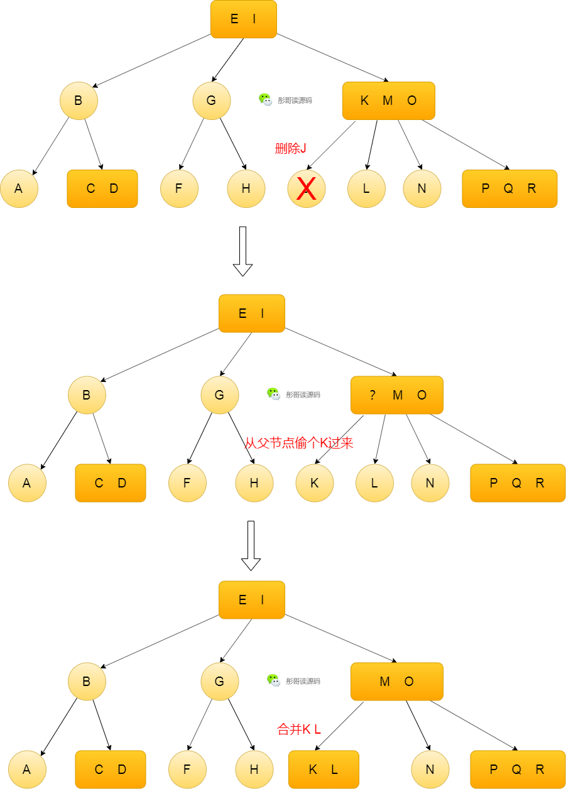

删除J时，从父节点先偷个K过来，此时父节点变成了3节点，所以，直接把M左边的两个元素合并即可。

（7）删除L

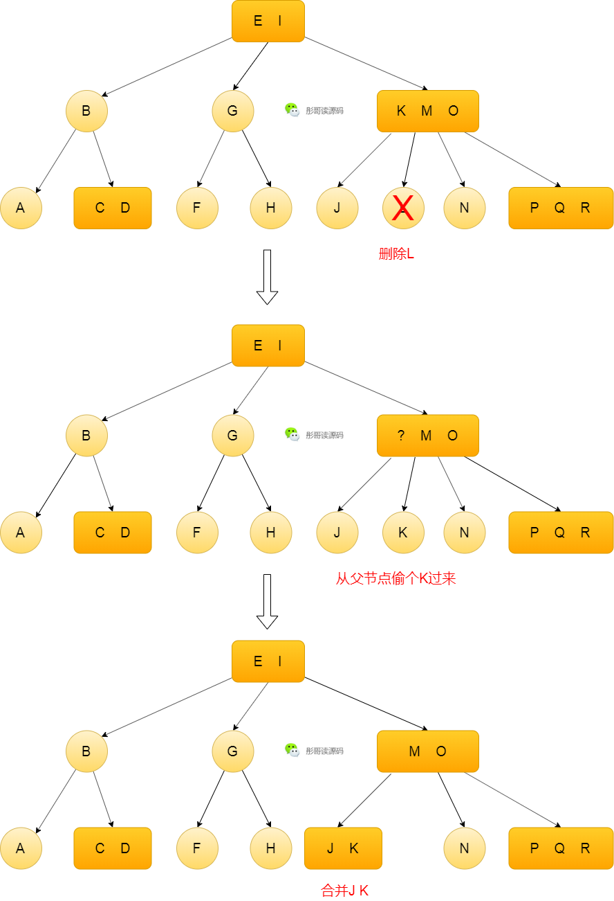

删除L的过程与删除J的过程有点像，也是从父节点偷K过来，然后再把M左边的两个元素合并。

（8）删除N

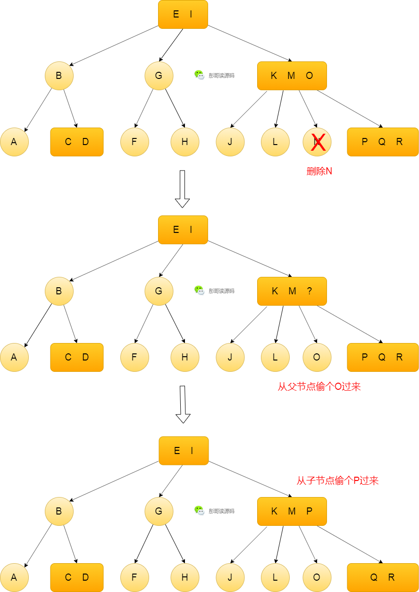

删除N时，从父节点偷个O过来，父节点再从其右子节点偷个P过来，偷个屁，偷个屁呀~~

好了，到此为止，2-3-4树删除元素的过程全解析完毕了，我这个示例中几乎包含了所有的场景，请多画图仔细体会，虽然画得想吐血了。

## 左倾红黑树删除元素

\> 注：红黑树的删除稍微有点小复杂，如果强型跟2-3-4挂钩会变得更复杂，所以，下面的内容不完全跟2-3-4树挂钩。

首先，我想问一个问题：一颗二叉查找树删除元素之后如何还能保证它还是二叉查找树呢？

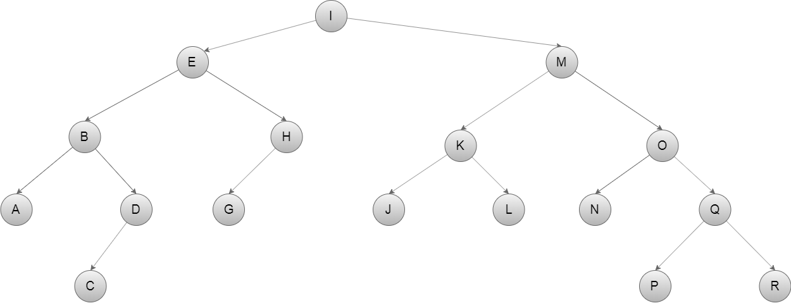

如果是叶子节点，删了也就删了，不影响，但如果是非叶子节点呢？比如，删除M这个元素。

其实，有两种方法：一种是找到M的前置节点并拿到M的位置，一种是找到M的后继节点并拿到M的位置。

什么是前置节点？什么是后继节点呢？好像二叉树里面只听说过父节点、子节点？

我们知道二叉查找树本质上是有序的，这个有序性指的是元素的自然顺序（还有一种有序性是插入顺序）。

所以，你把这颗二叉树中的所有元素排个序（或者中序遍历一下），在M前面的那个节点就是前置节点，在M后面的那个节点就是后继节点。

还有一种更形象的方法，M这个节点左子树中最大的元素就是M的前置节点，M节点右子树中最小的元素就是M的后继节点。

所以，删除M后，把L或者N移到M的位置就可以了，此时，就能保证二叉查找树依然是二叉查找树。

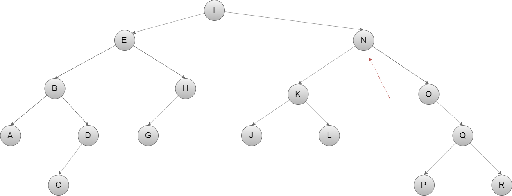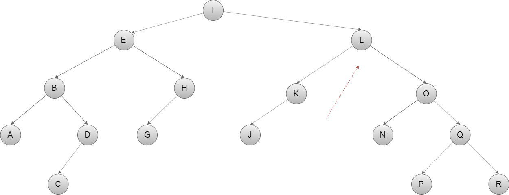

不过，大家好像都喜欢移后继节点，即右子树中最小的节点你如果看源码的话，会看到一个单词叫作`successor`，就是后继节点的意思。

好了，关于二叉查找树删除元素我们就讲这么多，还是回到红黑树删除元素的过程。

为了方便讲解，我构造了下面这么一颗红黑树：

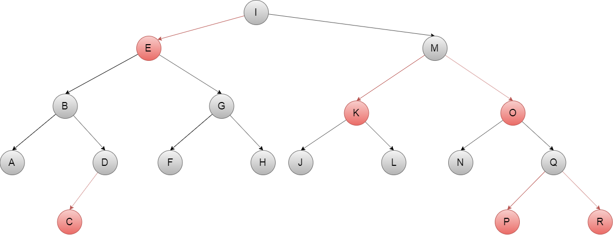

我们先来看一种最简单的情况，如果删除的是红色的叶子节点，比如，上图中的C、P、R这三个元素，如果它的父节点只有它这么一个子节点，直接删之，啥也不用管，比如C，如果它的父节点有两个子节点，那么会分成两种情况，一种是删除的右子节点，则直接删，比如R，另一种是删除的左子节点，那就做一次简单的左旋即可，比如P。

\> 我们这里讲的是左倾红黑树，如果是经典的红黑树，则删除红色叶子节点不需要旋转。

OK，我们再来看第二种情况，如果删除的是黑色的叶子节点呢？

我们知道，黑色节点删除之后，肯定不符合红黑树定义了，所以，肯定要进行再平衡的过程。

如果按照经典红黑树的说法，要看它的兄弟节点的颜色，有可能还要看它兄弟节点的子节点的颜色，情况大概有三四种，根本不可能记得住，我这里介绍一种更牛逼的方法，保证你看一遍就能记住。

我们以删除F节点为例，我先给出图示，下面再描述详细步骤：

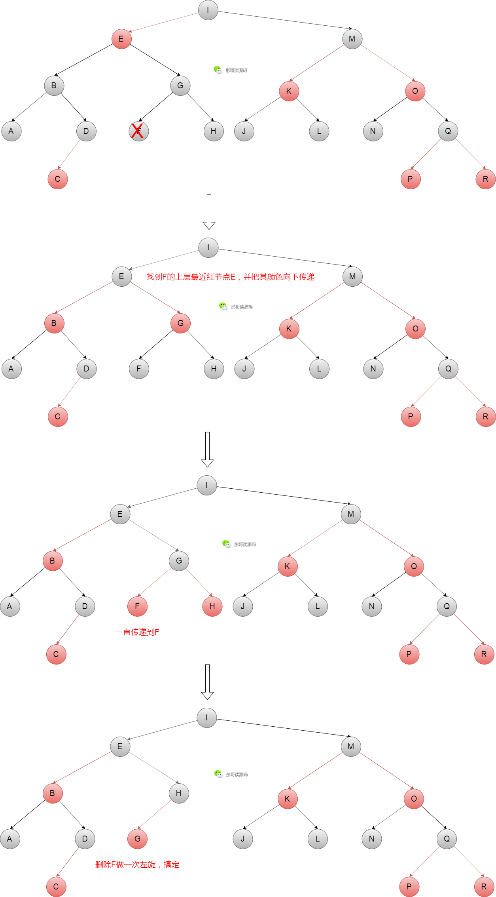

这种方法非常简单，F是黑色节点没错，那就想办法把它变成红色节点，怎么变呢？

那就得从它的上层节点动手，上层节点的红色其实是可以向下传递的，传递之后，整颗树其实还是红黑树，并不会打破原来红黑树的平衡，直到F变成红色的叶子节点，再一举把它删除，就很简单了。

这种方法相比于经典红黑树的方法，理解起来就容易得多了。

我们再举个删除L的例子，直接上图：

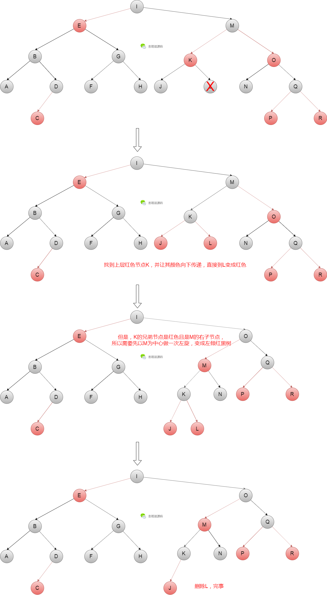

好了，上面说的都是删除叶子节点，那么，如果删除的是非叶子节点呢，比如删除E。

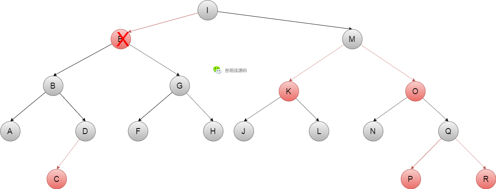

根据二叉查找树的特性，那么，我们会找到E的后继节点F，然后，把它移到E的位置，但是，此时，不符合红黑树的定义了，所以，你可以发现，其实，删除E相当于间接地删除F原来所在的节点位置，因此，又转化成了上面的删除叶子节点。

过程很简单，最后的结果与删除F的结果基本相同，只是原来E所在位置的元素变成了F，我就不画图了。

你可以想想删除M的过程~

总算讲完了，能看到这里的同学不容易，可能已经超出了一顿早餐的时间，我很抱歉！

# 后记

本节，我们从红黑树的本质，即2-3-4树出发，彻底掌握了一种不用死记硬背的方法来理解红黑树，你Get到了吗？欢迎留言评论。

有些同学看到这里，可能又说了：Talk is cheap, show me the code！

好，下一节，我就show you the code，敬请期待！

\> 关注公主号“彤哥读源码”，解锁更多源码、基础、架构知识。